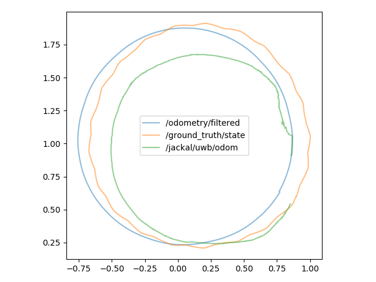

# Jackal Ad-Hoc Ultra-wideband localization

    
    
    
    
    
    

# Project Description

This project is meant to implement a localization algorithm where a [Jackal](https://clearpathrobotics.com/jackal-small-unmanned-ground-vehicle/) is combined with [Decawave Ultra-widebands](https://www.decawave.com/product/mdek1001-deployment-kit/) and is meant to be able to localize itself with both mobile and stationary anchors in the world.

# Installation

This project uses [`ROS Melodic`](http://wiki.ros.org/melodic) as its ROS backend.

To setup:

1. Either create a catkin workspace or navigate to its `src` folder
2. `git@github.com:Marius-Juston/UWB-Localization.git`
3. This project is also associated with [UWB-Jackal-World](https://github.com/Marius-Juston/UWB-Jackal-World)
   - Follow this page if you want to install the Gazebo environement for this project, though it is not necessary.
4. If you choose to not install Gazebo environement be sure to have the `gtec_rosmsgs` installed
    - Create a `gtec` folder in your catkin's `src`
    - `git clone https://github.com/valentinbarral/rosmsgs`
    - This installs the custom UWB ranging messages
    - Navigate to your base `cakin_ws` folder
    - `rospack profile`
    - `catkin_make`
    - `source ~/catkin_ws/devel/setup.bash`
      - This step is very important. Be sure to run this every time you open up a new terminal. If you do not you will get errors when trying to run the world, that you cannot see certain packages.
      -  To make things easier if you only have a single ROS build and  `catkin_ws`, then you can run: 
      - `echo "source ~/catkin_ws/devel/setup.bash" > ~/.bashrc`
      -  This will allow you to not have to run the source command every time.

# Files

## csv_creator.py

This converts a rosbag with the format: 

`rosbag record /ground_truth/state /gtec/toa/anchors /gtec/toa/ranging /odometry/filtered`

In to a csv file that be read and used offline. This can be usefull if you want to remove ROS from the equation all together. 

To use this:

1. `rossun uwb_localization csv_creator.py`
2. Run the rosbag you want to convert (i.e. `rosbag play *.bag`)
   - Be carefull because this csv_creator assumes that the anchors are currently stationary 

## location_drawer.py

This plots in real-time the location of the robot's positions in a matplotlib graph.

By default it plots:
- The actual robot's position (`/ground_truth/state`)
- The odometry position (`/odometry/filtered`)
- The UWB localization output (`/jackal/uwb/odom`) 

To use:
- `rosrun uwb_localization location_drawer.py`
  - Default parameters
- `rosrun uwb_localization location_drawer.py /jackal/uwb/odom`
  - Custom odometry message

